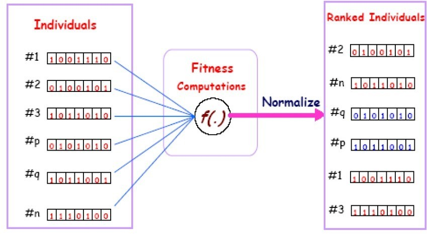
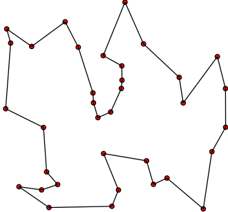

# Genetic Algorithm

> What is Genetic Algorithm ?
genetic algorithm (GA) is a metaheuristic inspired by the process of natural selection that belongs to the larger class of evolutionary algorithms (EA). Genetic algorithms are commonly used to generate high-quality solutions to optimization and search problems by relying on biologically inspired operators such as mutation, crossover and selection [[1]](en.wikipedia.org/wiki/Genetic_algorithm).

> The PseudoCode of Genetic Algorithm is like Below :

* Genetic Algorithm Contains Five Steps :

      * Initial Population .
      * Fitness Function .
      * Selection .
      * CrossOver .
      * Mutation .
---
## Initial Population :
A population is a group of individuals and each individual is a candidate solution to The problem. 

An individual contains  a set of parameters  known as Genes. those Genes form what we called Chromosome .   

To start a genetic algorithm, you have to provide it with a population to evolve. There are two main methods to initialize a population in a genetic algorithm:

* Random initialization: fill the initial population with completely random solutions.

* Heuristic initialization: Fill the initial population using a heuristic known for the problem.

---
## Fitness Function :

A fitness function is a particular type of objective function which takes as input a candidate solution and outputs the quality of this solution, therefore the fitness function makes it possible to evaluate the candidate solutions.

---

## Selection :

Selection is the process of selecting parents to generate the next generation.

There are several selection methods among the most used we have:

* Roulette Wheel Selection .
* Elitism Selection .
* Stochastic Universal Sampling Selection (SUS Selection) .
* Tournament Selection .
* Rank Selection .

## CrossOver :

The crossing operation is the reproduction of new chromosomes from the parent chromosomes.

There are several crossing methods among the most used we have:

* One Point Crossover .
* Multi Point Crossover .
* Davis Order Crossover (OX1) .
---
## Mutation :
the mutation can be defined as a small random modification of the chromosome, to obtain a new solution. It is used to maintain and introduce diversity in the genetic population and is generally applied with a low probability Pm.

There are several methods of mutation among the most used one has:
* Bit flip Mutation .
* Swap Mutation .
* Scramble Mutation .
* Mutation Inversion .

## Implementation :

> This Repository contains The Implementation of Genetic Algorithm to solve The Traveling Salesman Problem .

Genetic Algorithm can bet used to find high quality Solution in a short time for NP-Hard Problems such as Traveling SalesMan Problem , Knapsack problem , Clique problem ...

> The Traveling Salesman Problem looks like this :

TSP Mathematical Model is like below :

with T[i] is a candidate Tour , and f is the Fitness Function .

> The Fitness function in This case will looks like this :

with d is the euclidean distance between two point (Cities in this case ) :

## References :

* [Combinatorial Optimization (Wikipedia)](https://en.wikipedia.org/wiki/Combinatorial_optimization)

* [Mathematical optimization (Wikipedia)](https://en.wikipedia.org/wiki/Mathematical_optimization).

* [Natural Evolution (Wikipedia)](https://en.wikipedia.org/wiki/Evolution)

* [Genetic Algorithm (Wikipedia)](https://en.wikipedia.org/wiki/Genetic_algorithm) .

*  [Traveling Salesman Problem (Wikipedia)](https://en.wikipedia.org/wiki/Travelling_salesman_problem) .

* [Introduction to Genetic Algorithms (medium Blog Post)](https://towardsdatascience.com/introduction-to-genetic-algorithms-including-example-code-e396e98d8bf3) .

## Contributing :

> **if you want to contribute To This Repository just fork this repository and make your changes , and then make a pull Request .**