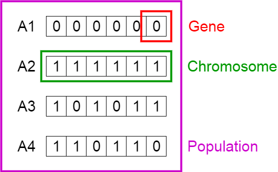

# Genetic Algorithm In C

This Folder Contains The Implementation of Genetic Algorithm to Solve Traveling Salesman Problem.

The PseudoCode of Genetic Algorithm is like Below :
 
<div align="center" >

</div>

* Genetic Algorithm Contains Five Steps :

      * Initial Population .
      * Fitness Function .
      * Selection .
      * CrossOver .
      * Mutation .
  
---  

### Initial Population :

<div align="center" >

</div>

Gene :
```python
from math import sqrt , pow

class city:

    def __init__(self,id,x,y):
        self.id = id
        self.x = x
        self.y = y
    
    def __str__(self):
        return "city {" + str(self.id) + " , " + str(self.x) +" , " + str(self.y) + "}"
    
    def getDistance(self,c):
        if self != None and c != None :
            distance = sqrt( pow(self.x - c.x , 2) + pow(self.y - c.y , 2))
            return distance    

```

Chromosome :

```python
class tour :

    def __init__(self , init):
        self.nbrCities = DataSet.getNbrCities()
        self.cities = [None] * self.nbrCities
        if init :
            self.initTour()
            self.fitness = self.calculateFitness()
        
    def __str__(self):
        path = ""
        for i in range(self.nbrCities):
            if i != self.nbrCities -1 :
                path += str(self.cities[i].id) + " -> "
            else :
                path += str(self.cities[i].id) + " . "             
        return path                   

    def initTourWithNone(self):
        for i in range(self.nbrCities):
            self.cities.append(None)
    
    def initTour(self):
        for i in range(self.nbrCities):
                city = DataSet.getRandomCity()
                while self.contain(city) :
                    city = DataSet.getRandomCity()
                self.cities[i] = city   

    def contain(self,city):
        for i in range(self.nbrCities):
            if self.cities[i] != None :
                if self.cities[i].id == city.id :
                    return True
        return False

    def getIndexOf(self,city):
        for i in range(self.nbrCities):
            if self.cities[i] == city.id :
                return i
        return -1        

    def calculateFitness(self):
        self.fitness = 0
        for i in range(self.nbrCities -1):
            self.fitness += self.cities[i].getDistance(self.cities[i+1])
        self.fitness += self.cities[len(self.cities) -1].getDistance(self.cities[0])
   
    def compare(self, other):
        return 1 if self.fitness < other.fitness else -1       

```

Population :

```python
class population :

    def __init__(self,populationSize,init):
        self.popSize = populationSize
        self.tours = [None] * self.popSize
        if init :
            self.initPopulation()
            self.calculateFitnessForAll()
            self.sortPopulation()           
            self.fittest = self.tours[0]
                
        

    def initPopulation(self):
        for i in range(self.popSize):
            self.tours[i] = tour(True)                

    def initPopulationWithNone(self):
        for i in range(self.popSize):
            self.tours.append(None)

    def sortPopulation(self):
        for i in range(self.popSize-1):
            index = i
            for j in range(i+1 , self.popSize):
                if self.tours[j].compare(self.tours[i]) > 0 :
                    index = j 
            tmp = self.tours[i]
            self.tours[i] = self.tours[index]
            self.tours[index] = tmp
    
    def getFittestTour(self):
        return self.fittest

    def getNFittestTour(self,n):
        return self.tours[:n]

    def calculateFitnessForAll(self):
        for i in range(self.popSize):
            self.tours[i].calculateFitness()        
```

---
### Fitness Function :

```python
def calculateFitness(self):
        self.fitness = 0
        for i in range(self.nbrCities -1):
            self.fitness += self.cities[i].getDistance(self.cities[i+1])
        self.fitness += self.cities[len(self.cities) -1].getDistance(self.cities[0])
```
---
### Selection Methods:

Elitism Selection :

```python
def elitismSelection(self,pop):
        pop.sortPopulation()
        elitismSubPopulation = pop.tours[:self.elitismSize + 1]
        return elitismSubPopulation
```

Touranment Selection :
```python
def touranmentSelection(self,pop):
        pool = [None] * self.poolSize
        for i in range(self.poolSize):
            index = random.randint(0,self.popSize -1)
            pool[i] = pop.tours[index]
        self.sortSubPopulation(pool)
        return pool[0]
```

---
### CrossOver Methods :

OX1 CrossOver :
```python
def Ox1CrossOver(self,parent1,parent2):
        child = tour(False)

        start = random.randint(0,parent1.nbrCities)
        end   = random.randint(0,parent1.nbrCities)

        
        while start >= end :
              start = random.randint(0,parent1.nbrCities)
              end = random.randint(0,parent1.nbrCities)      
        
        for i in range(start,end):
            child.cities[i] = parent1.cities[i]            
        
        for i in range(parent2.nbrCities):
            if not child.contain(parent2.cities[i]) :
                for j in range(parent2.nbrCities):
                    if child.cities[j] is None :
                        child.cities[j] = parent2.cities[i]
                        break
        return child
```

### Mutation methods :

Swap Mutation :
```python
def SwapMutation(self,child):
        for i in range(child.nbrCities):
            mutationProbability = random.random()
            if mutationProbability < self.mutationRate :
                    mutationPoint = random.randint(0 , child.nbrCities -1)
                    tmp = child.cities[mutationPoint]
                    child.cities[mutationPoint] = child.cities[i]
                    child.cities[i] = tmp
```
---
### Reproduction :

```python
def reproduction(self,pop):
        newpop = population(pop.popSize,False)
        elitismSubPopulation = self.elitismSelection(pop)
        
        
        for index in range(self.elitismSize):
            newpop.tours[index] = elitismSubPopulation[index]
        
        for i in range(index , pop.popSize): 
            parent1 = self.touranmentSelection(pop)
            parent2 = self.touranmentSelection(pop) 
              
            child = self.Ox1CrossOver(parent1, parent2)

            self.SwapMutation(child)
            child.calculateFitness()
            newpop.tours[i] = child
        
        newpop.calculateFitnessForAll()
        newpop.sortPopulation()
        newpop.fittest = newpop.tours[0]
        return newpop
```

---
### Genetic Algorithm :

```python
def __init__(self,nbrGenerations,popSize,elitismSize,poolSize,mutationRate):
        self.nbrGenerations = nbrGenerations
        self.popSize = popSize
        self.elitismSize = elitismSize
        self.poolSize = poolSize
        self.mutationRate = mutationRate
        self.initialPopulation = population(self.popSize , True)
        self.fitnesses = np.zeros(self.nbrGenerations)
        print("Initial Fitness : " , self.initialPopulation.fittest.fitness)
        print("Best Tour : ",self.initialPopulation.fittest)
        newPopulation = self.initialPopulation
        generationCounter = 0
        for i in range(self.nbrGenerations):
            newPopulation = self.reproduction(newPopulation)
            self.fitnesses[generationCounter] = newPopulation.fittest.fitness
            generationCounter += 1

            print("Generation : ", generationCounter  )
            print("Fitness : ", newPopulation.fittest.fitness)
            print("Best Tour : ",newPopulation.fittest)
            print("\n\n")
```
---
This Folder Contains a list of TSP Instances you can find them in this Folder : [Instances](DataSets/) , This Folder Contains :

* bayg29
* Berlin52
* burma14
* Eil51
* Eil101
* pr76
* st70
* ulysses22
* ulysses216

To Test one of this instances Meke this changes :

* Go to this File [Main](main.py) and change The File Name in The Function ReadDataSet .

```python
DataSet.readDataSet("_Berlin52.txt")
```
